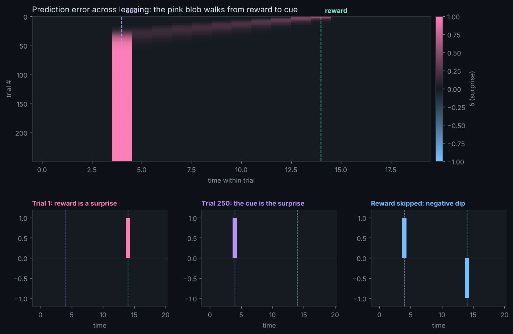

# Dopamine Detective

This tiny temporal-difference learning model reproduces a famous result: the surprise signal starts at the reward, then migrates back to the cue that predicts it, and dips below baseline when an expected reward doesn't show up.

## Run it

    pip install numpy matplotlib
    python detective.py

## Play with it

- Change `ALPHA` (learning rate) and see how many trials it takes to learn
- Set `GAMMA` below 1 to make the agent impatient
- Move `REWARD` closer to or farther from `CUE`

## Neuroscience notes

The signal plotted is the reward prediction error: delta = reward + predicted future value - current prediction. It matches recordings of midbrain dopamine neurons described by Schultz, Dayan and Montague (1997), "A neural substrate of prediction and reward."
